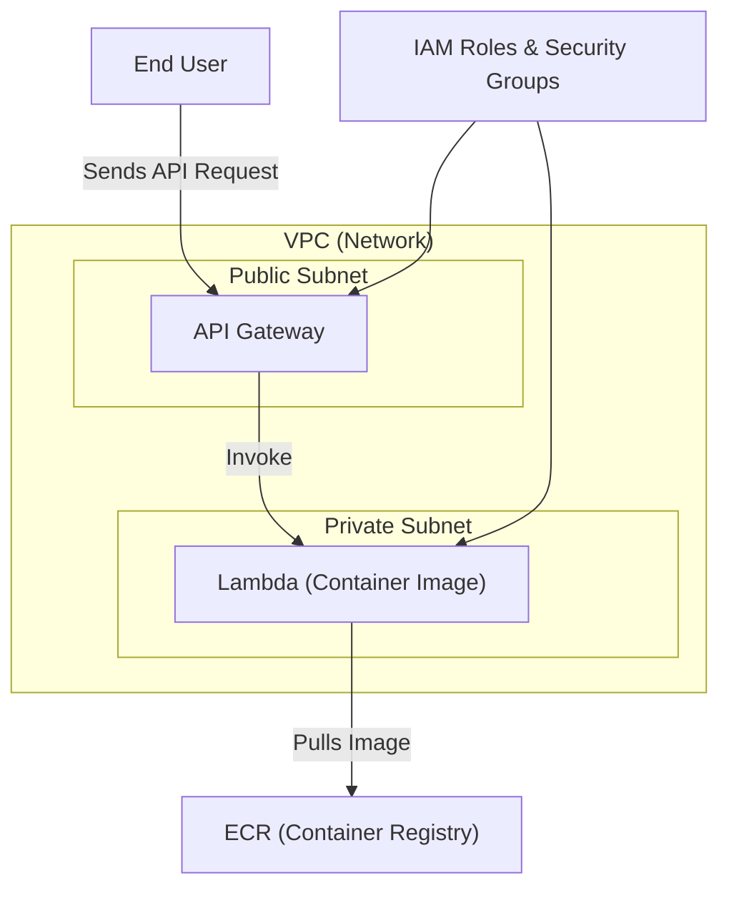

<h3 align="center"><strong>AWS Lambda Container Deployment Track</strong></h3>

---
### Objective
&nbsp; &nbsp; &nbsp; &nbsp; &nbsp; &nbsp; &nbsp; &nbsp; Deploy the containerized microservices using AWS Lambda with container images, demonstrating your skills in serverless architecture, containerization, and AWS services.

---
### Technical Requirements
1.	#### Infrastructure as Code (Terraform)
    *	Provision a VPC with public and private subnets (if needed)
    *	Set up Lambda functions configured for container image deployment
    *	Configure necessary IAM roles and security groups
    *	Set up an ECR repository for your container images
    *	Create an API Gateway to trigger your Lambda functions
  
2.	#### Containerization
    *	Create a Dockerfile for the microservices, optimized for Lambda
    *	Build and push the Docker image to ECR

3.	#### Lambda Configuration
    *	Configure Lambda functions to use container images
    *	Set up appropriate memory and timeout settings
  	
4.	#### CI/CD (GitHub Actions)
    *	Implement a workflow for Terraform (lint, plan, apply)
    *	Create a workflow for building and pushing Docker images
    *	Implement a workflow for updating Lambda functions

5.	#### Monitoring and Logging
    *	Set up CloudWatch for Lambda logging and metrics
    *	(Bonus) Implement X-Ray for distributed tracing

---

### Deliverables
1.	#### GitHub repository containing:
    *	Terraform code
    *	Dockerfiles optimized for Lambda
    *	GitHub Actions workflows
    *	Application code (provided microservices)

2.	#### Documentation:
    *	Architecture diagram
    *	Setup and deployment instructions
    *	Monitoring and logging overview

---

### Evaluation Criteria
1.	Lambda configuration and security
2.	API Gateway setup and integration
3.	CI/CD pipeline efficiency and reliability
4.	IaC quality and modularity
5.	Containerization best practices for Lambda
6.	Monitoring and logging effectiveness
7.	Documentation clarity and completeness

---

### Step by Step explanation of above project.

#### Step01: Infrastructure as Code (Terraform)
```sh
# 1. Instead of clicking around in the AWS Console, we write Terraform scripts.
# 2. Terraform lets us describe our AWS setup as code → this makes it repeatable,
#    version-controlled, and easy to share with teammates.
```
   *	Provision a VPC with public and private subnets (if needed)
```sh
# 1. A VPC is like your own private network inside AWS.
# 2. Inside it, we create subnets:
#   Public Subnet → resources accessible from the internet (like an API Gateway or Load Balancer).
#   Private Subnet → resources not directly accessible from the internet (like Lambda functions or databases).
# 3. This ensures security + controlled access.
```
   *	Set up Lambda functions configured for container image deployment
```sh
# 1. Normally, Lambda runs small bits of code (Python, Node.js, etc.).
# 2. In this project, we package our application as a Docker container and push it to AWS.
# 3. Lambda then pulls that container image from ECR and runs it whenever triggered.
# 4. This is useful for complex dependencies that don’t fit in the normal zip upload.
```
   *	Configure necessary IAM roles and security groups
```sh
# 1. IAM Roles → permissions for services. Example:
#   Lambda needs permission to pull images from ECR.
#   API Gateway needs permission to invoke Lambda.
# 2. Security Groups → act like firewalls controlling who can talk to what.
#   Example: Allow API Gateway traffic to reach Lambda, but block unwanted access.
```
   *	Set up an ECR repository for your container images
```sh
# 1. ECR (Elastic Container Registry) is like AWS’s version of Docker Hub.
# 2. We build our Docker image locally (or in CI/CD) → push it to ECR.
# 3. Lambda then uses that image whenever it runs.
```
   *	Create an API Gateway to trigger your Lambda functions
```sh
# 1. API Gateway is the entry door for your users.
# 2. Example: When a user calls https://myapi.com/patient, API Gateway receives the request → passes
#    it to the right Lambda function.
# 3. This allows you to expose your Lambda as a REST API or HTTP endpoint.
```


